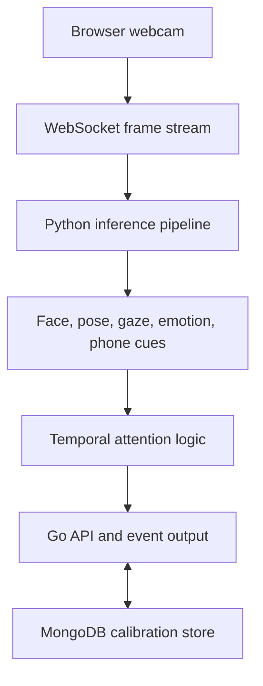
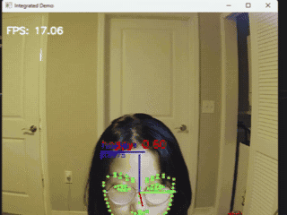
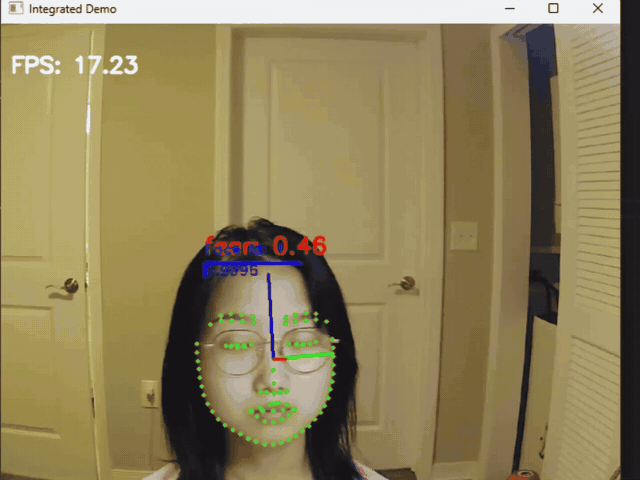
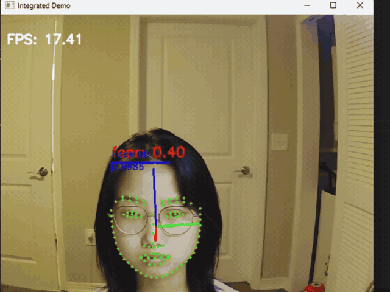
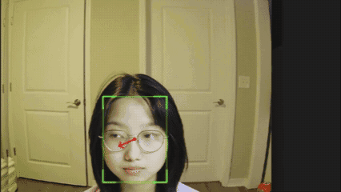

# Real-Time Student Attention Detector

A real-time multimodal computer-vision pipeline for estimating student attentiveness from a consumer webcam. The system combines facial landmarks, head pose, gaze, emotion, phone detection, and temporal aggregation, then exposes attention events through a lightweight Go API.

> This repository is a portfolio version of work completed during my 2025 Machine Learning Research Internship at Guardian Airwaves. It has been cleaned for public release; model weights and raw user recordings are not included. Four authorized, compressed demo clips are provided below.

## Highlights

- Fuses **SPIGA facial landmarks/head pose**, **Gaze360-style gaze estimation**, **ResEmoteNet emotion recognition**, and **YOLOv8 phone detection**.
- Uses personalized five-point gaze calibration to adapt decision boundaries to each camera and screen setup.
- Applies temporal smoothing and sliding-window aggregation to reduce unstable frame-level predictions under occlusion, lighting variation, and motion.
- Connects a browser webcam client, a Python inference service, MongoDB-backed calibration storage, and a Go event API.
- Internship benchmarks reached **>90% accuracy** and **<80 ms latency** on consumer GPUs; TensorRT/CUDA optimization reduced latency by approximately **40%** and improved throughput by approximately **1.5x**.

## System Overview



## Attention Signals

| Signal | Implementation | Example trigger |
|---|---|---|
| Face presence | RetinaFace/SPIGA tracking | No face or persistent occlusion |
| Head pose | SPIGA landmark and pose estimation | Yaw or pitch outside the screen-view range |
| Gaze | Personalized gaze estimator | Gaze outside calibrated screen bounds |
| Emotion | ResEmoteNet classifier | High-confidence non-neutral distraction cue |
| Phone use | YOLOv8 detector | Phone detected in the frame |

The frame-level cues are aggregated over a configurable window. The pipeline emits `slightly inattentive` or `heavily inattentive` events when the corresponding ratio thresholds are exceeded.

## Demo

| Face presence | Head pose |
|---|---|
|  |  |

| Emotion cue | Gaze calibration |
|---|---|
|  |  |

## Repository Structure

```text
.
|-- run_demo_test.py       # Multimodal inference and temporal logic
|-- gaze.py                # Gaze model, calibration, and phone detection
|-- server.py              # Browser-to-Python WebSocket frame bridge
|-- main.go                # Go API, calibration storage, and event endpoint
|-- static/                # Webcam and calibration pages
|-- approach/              # ResEmoteNet implementation
|-- models/                # Supporting model definitions
|-- requirements.txt
`-- third_party/           # Third-party license notices
```

## Setup

### Prerequisites

- Python 3.10+
- Go 1.22+
- MongoDB running locally or available through `MONGODB_URI`
- A CUDA-capable GPU is recommended for the full real-time pipeline

### 1. Install dependencies

```bash
python -m venv .venv
source .venv/bin/activate  # Windows: .venv\Scripts\activate
pip install -r requirements.txt
```

Install the PyTorch build that matches your CUDA environment from the [official PyTorch selector](https://pytorch.org/get-started/locally/).

### 2. Download model weights

Model weights are intentionally excluded from Git. Place the required files as follows:

```text
student-attention-detector/
|-- resnet34.pt
`-- models/
    |-- best_model.pth
    |-- model_final.pt
    `-- yolov8n.pt
```

The code uses pretrained checkpoints for gaze estimation, emotion recognition, face analysis, and phone detection. Only use checkpoints whose licenses permit your intended use.

### 3. Configure the API

```bash
cp .env.example .env
```

Update `MONGODB_URI` if MongoDB is not running at the default local address. Keep the server bound to a trusted development environment; the prototype API is not designed for public internet exposure.

### 4. Start the application

```bash
go run .
```

Open `http://localhost:4040` and select **Start**. For first-time calibration, open `http://localhost:4040/calibrate.html`.

The browser will request webcam permission and stream JPEG frames to the local WebSocket bridge. The Go server launches the Python inference process for the supplied user ID.

## Configuration

```bash
python run_demo_test.py --help
```

| Argument | Default | Description |
|---|---:|---|
| `--user_id` | required | Session identifier |
| `--window` | `180` | Aggregation window in seconds |
| `--thresh1` | `0.10` | Slight-inattention ratio threshold |
| `--thresh2` | `0.30` | Heavy-inattention ratio threshold |
| `--dataset` | `wflw` | SPIGA landmark configuration |
| `--tracker` | `RetinaSort` | Face tracker |

## Privacy and Responsible Use

This prototype analyzes webcam frames and behavioral cues. It should not be used as the sole basis for educational, employment, disciplinary, or other high-impact decisions. Obtain informed consent, minimize data collection, protect calibration records, and evaluate performance across lighting conditions, camera setups, skin tones, eyewear, and accessibility needs.

The included demo recordings contain identifiable facial imagery and are published with the subject's authorization. Do not reuse them for training or evaluation without separate permission.

## Attribution

This project depends on [SPIGA](https://github.com/andresprados/SPIGA) for facial landmark and head-pose estimation. The original BSD 3-Clause license is preserved in [`third_party/SPIGA_LICENSE`](third_party/SPIGA_LICENSE).

## Author

**Feiya Xiang** - Ph.D. student in Electrical and Computer Engineering at NC State University
